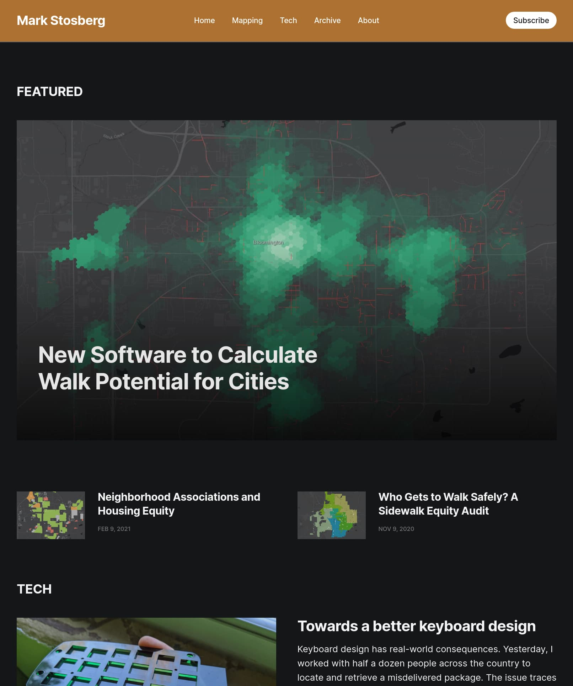
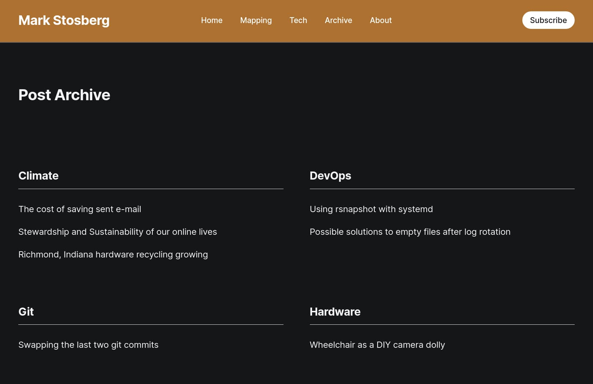

# Headline

Headline is a [Ghost](https://github.com/TryGhost/Ghost) theme built from the ground up for local news. While it can be used for any purpose, the theme takes a thoughtful approach to displaying large amounts of content across various areas of coverage. Headline adapts to your content by showcasing your most written about topics or by giving you the control to decide which topics are front and center.

**Demo: https://headline.ghost.io**

## About headline-markstos

This fork of the headline theme was created to add dark mode as well as other customizations
which make it suitable to use for a personal blog.

 * Featured content rather than Latest content is highlighted on the top of the front page.
   The latest content for different tags still appears below.
 * A custom "archive" page displays all content arranged by tag.
 * Author photos and names are removed from post, since a personal blog has one author.

While the theme free to use, I maintain it for personal use and no compatibility gurantees are made
about future updates.

## Screenshots

### Front Page



### Archive page



## To Enable Dark Mode

After the theme is installed, look under "Site-wide" settings for the theme to select Dark or Auto.

## To use the custom archive page

 * First, follow the usual steps to update your `routes.yaml` file. Example below.
 * Then, update your Navigation in settings to link to it.

```
routes:
  /archive/:
    template: archive
```

## To customize

First, you'll need to checkout the `markstos` branch of this repo.

`git` and `yarn` should already be installed.

    git clone --branch markstos git@github.com:markstos/Headline-markstos.git
    yarn

Although the theme will appear as `headline-markstos` when installed, it is
stored in the directory named just `headline`, to make it easier for me
to maintain a fork of the headline theme. That's why you see both
names mentioned below.

## To create a zip file of the headline-markstos theme

From the root directory of the Headline repo:

    yarn zip

This will produce a zip file at `dist/headline-markstos.zip`

Then it can be uploaded through the Ghost admin area, where it will be recognized as the "headline-markstos" theme.

# Instructions

1. [Download this theme](https://github.com/markstos/Headline-markstos/archive/markstos.zip)
2. Log into Ghost, and go to the `Design` settings area to upload the zip file

# Development

Edition styles are compiled using Gulp/PostCSS to polyfill future CSS spec. You'll need [Node](https://nodejs.org/), [Yarn](https://yarnpkg.com/) and [Gulp](https://gulpjs.com) installed globally. After that, from the theme's root directory:

```bash
# Install
yarn

# Run build & watch for changes
yarn dev
```

Now you can edit `/assets/css/` files, which will be compiled to `/assets/built/` automatically.

The `zip` Gulp task packages the theme files into `dist/headline.zip`, which you can then upload to your site.

```bash
yarn zip
```
## Copyright & License

Copyright (c) 2013-2023 Ghost Foundation - Released under the [MIT license](LICENSE).
